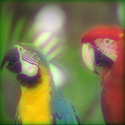
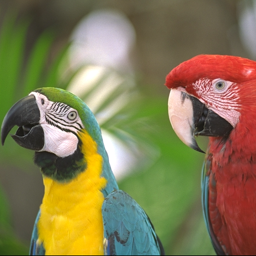
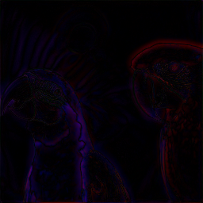
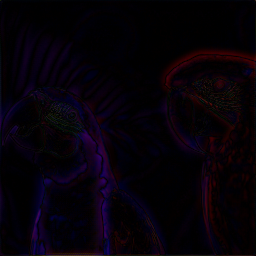

# Image Deblurring with Fourier Optics

This repository implements an image deblurring system using a physically-based blur model from Fourier optics and trains neural networks to reverse the blur. The blurred dataset is generated by convolving sharp images with point spread functions (PSFs) based on depth and chromatic aberration. Deblurring is performed using deep learning models like U-Net and DnCNN.

## Project Structure
```
.               
├── data/                 # Contains train/test images and precomputed PSFs
│   ├── train/
│   ├── val/
│   ├── test/
│   ├── dataset.py        # Custom dataset class with blur simulation
│   ├── loader.py         # DataLoader setup
│   └── PSFPrecomputer.py # PSF bank generation using Fourier optics
├── config.yaml           # Training configuration
├── evaluate.py           # Single inference
├── inference.py          # Batch inference
├── model.py              # Contains U-Net and DnCNN architectures               
├── parameters.py         # Physical parameters
├── README.md                     
├── train.py              # Training script
└── utils.py              # Helper functions (e.g., fftconv2d)
```

## Installing Dependencies

```bash
pip install torch torchvision torchmetrics numpy matplotlib Pillow
```

## Prepare Dataset
Download the [`mini-imagenet.zip`](https://www.kaggle.com/datasets/ambityga/mini-imagenet), extract the `train/` and `test/` folders and move `25%` of the images from the `train/` folder to `val/` folder using the `scripts/splitter.py` so that we have the following folder structure.
```
data/
├── train/
├── val/
├── test/
├── dataset.py
├── loader.py
└── PSFPrecomputer.py
```
## Precompter PSF Bank
To prevent computation overhead due to Fourier Transform calculation, PSFs are computed before-hand and saved. Given that the `z_near` and `z_far` are provided, and assuming a `z_step` of `0.01`, we calculate and save the PSFs by running:
```
python -m data.PSFPrecomputer.py
```
and outputing:
```
Computed PSF bank for z range (1.84, 2.2) with step 0.01.
Number of z values: 37
PSF shape: (37, 3, 256, 256)
PSF bank saved to psf_bank.npz
```
The PSF bank will be saved in `data/psf_band.npz`.

## Train the Model
Edit the `config.yaml` file for training options, then run:
```bash
python train.py
```
Supported models: `U-Net`, `DnCNN`. (Specify the model nam in `config.yaml` under `MODEL.name`)
Loss function: MSE (Mean Squared Error)
## Evaluate a checkpoint
Two modes for inference:
### Batch Inferenc with `inference.py`
To deblur all sharp test images, for instance, update the constant at the top accordingly:
```python
EXPERIMENT_PATH     = "logs/<experiment_name>"
CHECKPOINT_NAME     = "best_psnr.pth"           # or best_ssim.pth or last.pth
INFERENCE_INPUT_DIR = "data/test"               # Image directory of test_set
RESULT_SUBDIR       = "inference_results"       # Directory to save results
DEVICE              = "cuda"                    # or "cpu"
```
This will:

- Load the test set from INFERENCE_INPUT_DIR

- Apply depth-dependent blur using precomputed PSFs

- Run the model checkpoint on the blurred images

- Save the deblurred results under: 
```
logs/<experiment_name>/inference_results/<timestamp>/
```
Folder structure would look like the following.
```
logs/
├── <experiment_name>/
│   ├── checkpoints/
│   │   ├── best_psnr.pth
│   │   ├── best_ssim.pth
│   │   └── last.pth
│   ├── inference_results/
│   │   ├── <timestamp>
│   │   │   ├── deplurred_images/
│   │   │   ├── metrics.csv
│   │   │   └── sample_gris_xxxxxx.png
│   │   ├── ...
│   ├── tensorboard/
│   └── config.yaml
├── <experiment_name>/
│   └── ...
```
### Single Inference with `evaluate.py`
Use `evaluate.py` to test a trained model on one specific image at a chosen depth `z`. To do so, open the file and edit these fields accordingly:

```python
SHARP_IMG_PATH  = "_instruction/parrots256.png"
CKPT_PATH       = "logs/<experiment_name>/checkpoints/best_psnr.pth"
z = 1.8 
```
Then, run
```bash
python evaluate.py
```
This will:

- Apply optical blur to the image using the PSF at depth `z`

- Run the neural network model

- Show and save the deblurred result (`deblurred_result.png`)

The function `evaluate()` returns a NumPy array of shape `(H, W, 3)` with values clipped to [0, 1].

### Metrics
- PSNR (Peak Signal-to-Noise Ratio)
- SSIM (Structural Similarity Index)
- MSE (Mean Squared Error)

These are computed during validation.

## Example Results

| Model               | Blurred Input                        | Deblurred Output                    | Ground Truth                        | Difference Map                          | Metrics                                   |
|---------------------|--------------------------------------|-------------------------------------|-------------------------------------|------------------------------------------|--------------------------------------------|
| <div style="writing-mode: vertical-rl; transform: rotate(180deg);">DnCNN</div><br> |  |   |         |     | <pre>PSNR = 27.735<br>SSIM = 0.9029<br>MSE  = 0.0017</pre> |
| <div style="writing-mode: vertical-rl; transform: rotate(180deg);">UNet</div>         |  |    |         |      | <pre>PSNR = 27.420<br>SSIM = 0.9008<br>MSE  = 0.0018</pre> |


## Conclusion

This project demonstrates a physically inspired approach to image deblurring by simulating realistic optical blur through Fourier optics. By integrating depth-dependent and chromatic aberration-aware PSFs into the data generation pipeline, we train deep learning models like DnCNN and U-Net to effectively restore sharpness from blurred inputs.

Both models perform competitively, with DnCNN slightly outperforming U-Net in our reported test case. Visual and quantitative comparisons (PSNR, SSIM, MSE) confirm that the networks successfully learns to reverse the simulated degradations.

## 📘 Reports

👉 Technical Report [[PDF](https://studentuef-my.sharepoint.com/:b:/g/personal/frnegasa_uef_fi/EQ-l6nWv5jFJoA3TWDrAW2YBYONNVIB8tlnCv2gkQSo4GQ?e=qmD6iG)] [[Overleaf](https://www.overleaf.com/read/rmmrhndxpkht#6d2efe)]

👉 Literature Review [[PDF](https://studentuef-my.sharepoint.com/:b:/g/personal/frnegasa_uef_fi/EfVVey3vDepDkZoXrASqwLUBbZORjO-4MfwHv2wvLmbeig?e=MRyues)] [[Overleaf](https://www.overleaf.com/read/hsjqkgdpfkhf#e5b3b7)]


---


